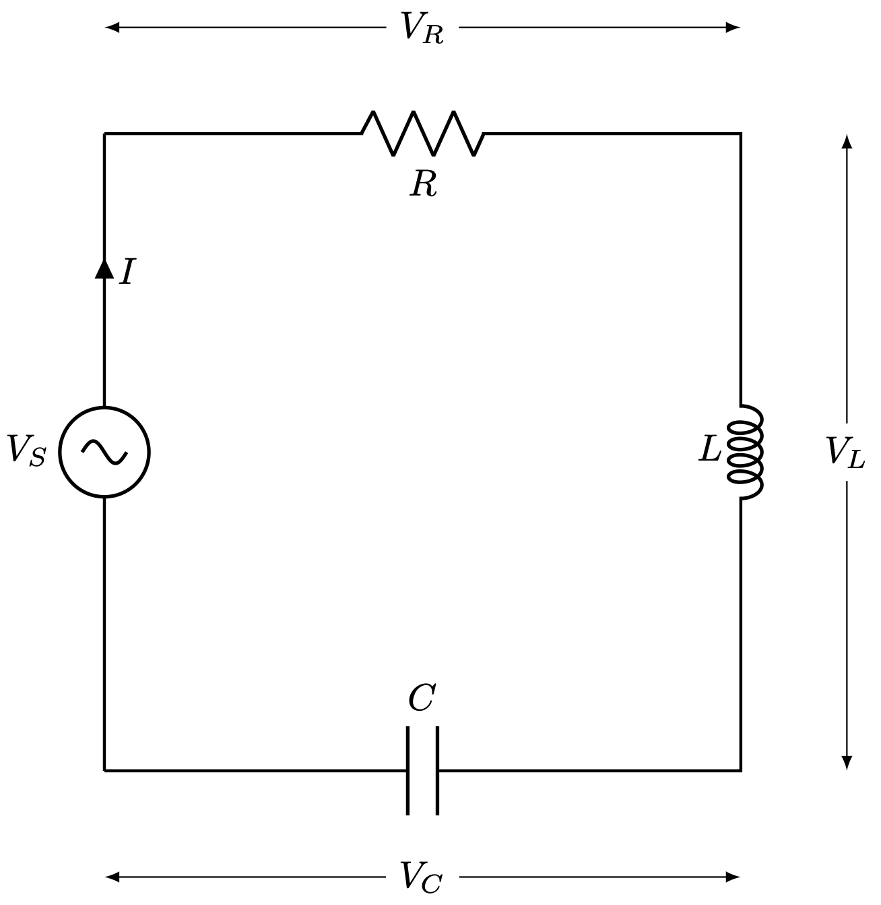

# RLC Circuit — Frequency Response & Coupled Circuit Analysis

Experimental data analysis for inductively coupled RLC circuits from Physics Lab II (77335) at the Hebrew University of Jerusalem. Fits measured AC current amplitudes to the theoretical impedance model and extracts circuit parameters ($R$, $L$, $C$) with full error propagation.

---

## Highlights

- **Nonlinear least-squares fitting** (`scipy.optimize.curve_fit`) of $|I(f)|$ to the RLC impedance model
- **Coupled circuit analysis**: inductively coupled two-loop RLC system
- Resonance frequency, Q-factor, and bandwidth extracted from fit parameters
- Full uncertainty propagation from oscilloscope data to final parameters

---

## Physics

For a series RLC circuit driven at frequency $f$:

$$|I(f)| = \frac{V_0}{\sqrt{R^2 + \left(\omega L - \frac{1}{\omega C}\right)^2}}, \quad \omega = 2\pi f$$

Resonance occurs at $f_0 = 1/(2\pi\sqrt{LC})$ with quality factor $Q = \omega_0 L / R$.

<p align="center">
  
</p>

---

## Contents

| File | Description |
|------|-------------|
| `fitt_RLC_AC_with_error.py` | Series RLC frequency-response fitting |
| `coupled_fit.py` | Inductively coupled two-loop circuit fitting |
| `RLC/` | Analytical Fourier-transform solution (LaTeX) |

---

## Usage

```bash
pip install numpy scipy matplotlib pandas
python fitt_RLC_AC_with_error.py
python coupled_fit.py
```
